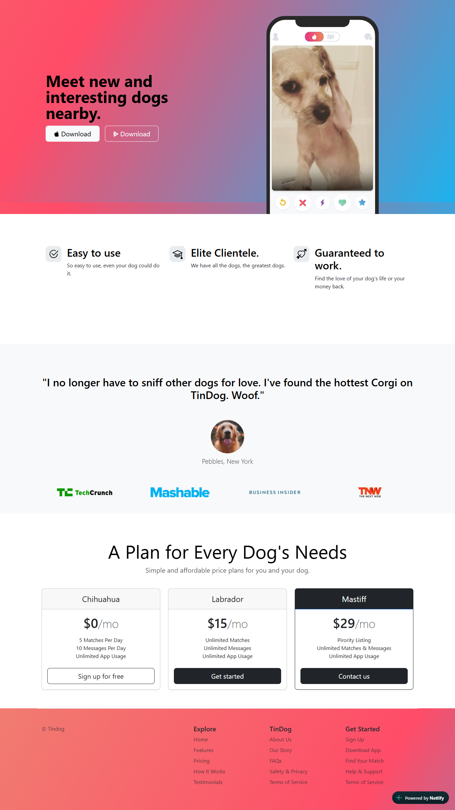

# 🐶 TinDog

> A dating app for dogs. Meet new and interesting dogs nearby.

A fully responsive marketing/landing page for a fictional dog-dating app, built with **HTML5**, **CSS3**, and **Bootstrap 5**. This project was built as a practical exercise in responsive design and working with a component framework rather than hand-rolling layout from scratch.



## 🔗 Live Demo

> `https://tindog-a-dating-site.netlify.app/`

## ✨ Features

- Fully responsive layout (mobile, tablet, desktop) powered by Bootstrap's grid system
- Animated, looping gradient hero background
- Feature highlights section with icon cards
- Customer testimonial section with "as seen in" press logos
- Three-tier pricing table
- Multi-column footer with site navigation

## 🛠 Built With

- HTML5
- CSS3 (custom gradient animation + Bootstrap overrides)
- [Bootstrap 5.3](https://getbootstrap.com/)
- [Bootstrap Icons](https://icons.getbootstrap.com/) (inlined as SVG)

## 📂 Project Structure

```
TinDog/
├── index.html              # Main page markup
├── css/
│   └── style.css           # Custom styles & Bootstrap overrides
├── images/                 # Site images, logos, and favicon
├── .github/
│   └── screenshots/        # Preview image(s) used in this README
├── package.json            # Optional dev-server convenience script
├── .gitignore
├── LICENSE
└── README.md
```

## 🚀 Getting Started

This is a static site — no build step or backend required.

**Option 1: Just open it**

Clone the repo and open `index.html` directly in your browser:

```bash
git clone https://github.com/<your-username>/tindog.git
cd tindog
open index.html   # macOS
# or just double-click index.html in your file explorer
```

**Option 2: Run a local dev server (recommended, avoids CORS/caching quirks)**

Requires [Node.js](https://nodejs.org/) installed.

```bash
npm install
npm start
```

This spins up [live-server](https://www.npmjs.com/package/live-server) on `http://localhost:5500` with live reload.

> **Note:** This is a plain HTML/CSS project — there's no Python involved, so no `requirements.txt` is needed. `package.json` above is purely optional, for anyone who wants a local dev server with auto-reload.

## 🌐 Deploying

Since this is a static site, you can deploy it for free in a couple of clicks:

- **GitHub Pages:** Settings → Pages → Deploy from branch → `main` / root
- **Netlify / Vercel:** Drag-and-drop the folder, or connect the GitHub repo directly

## 🙏 Acknowledgements

- Project brief based on the **TinDog** exercise from Dr. Angela Yu's *Complete Web Development Bootcamp* ([App Brewery](https://github.com/appbrewery/tindog))
- Built with [Bootstrap](https://getbootstrap.com/)

## 📄 License

This project is licensed under the MIT License — see the [LICENSE](./LICENSE) file for details.
